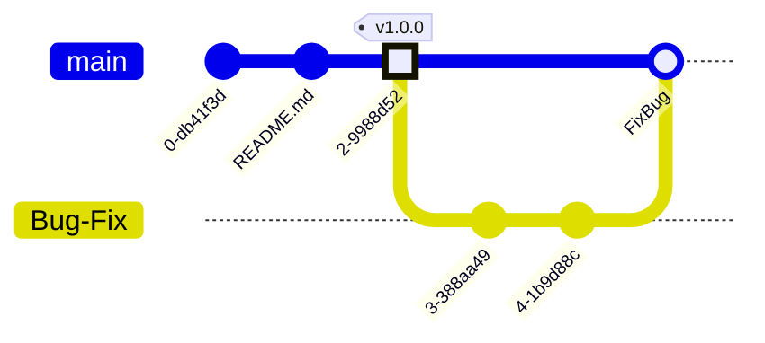

# Mermaid

`Mermaid`是一种受md启发的绘图工具。

## Graph & Syntax

Here introduced the syntax of several useful grapghs.
更多内容见[Guide](https://mermaid.js.org/intro/)

### gitGraph

`GitGraph`中的绘图方法模仿`git`操作, 下面仅仅列举了少数内容,具体见[mermaid教程](https://mermaid.js.org/syntax/gitgraph.html)

1. 命令诸如:
- commit
- merge
- branch
- checkout

2. 时间线
绘图的时间线和git操作的时间线类似,效果是将`git`一系列的命令操作可视化.

Example还演示了一些便于**可视化**的语法,如`id`,`type`:{NORMAL, REVERSE, HIGHLIGHT},`tag`

